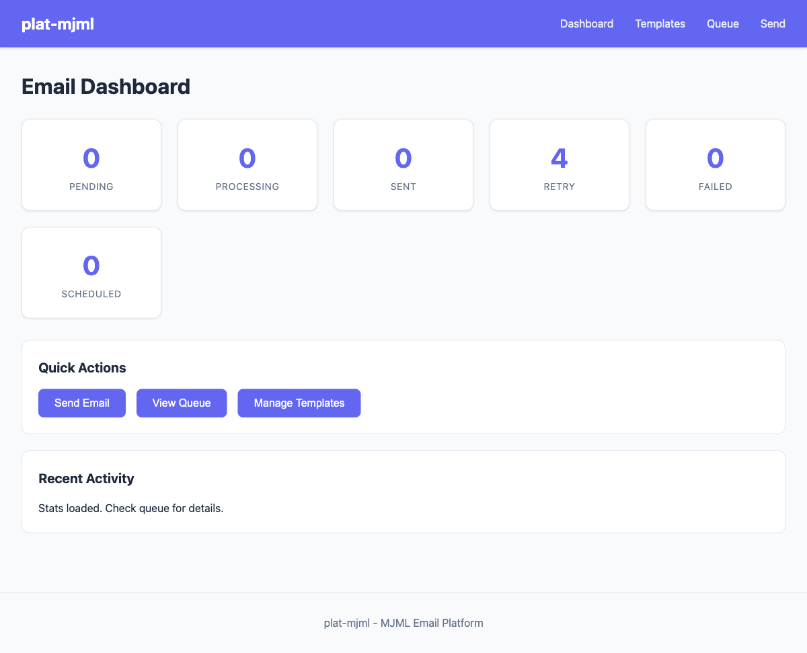
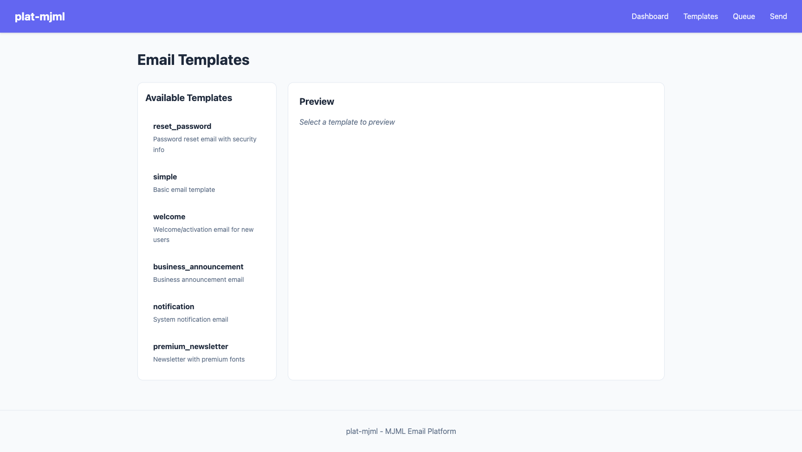
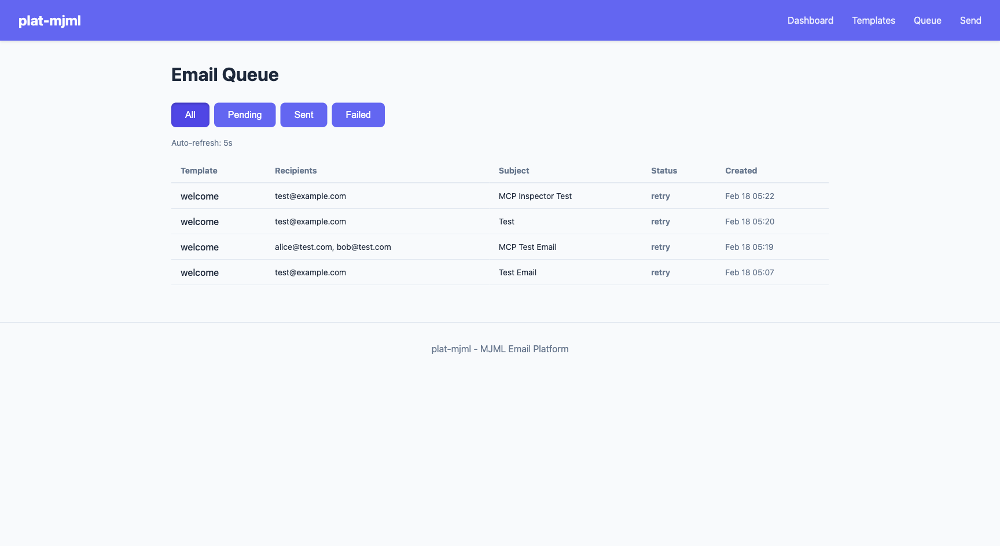
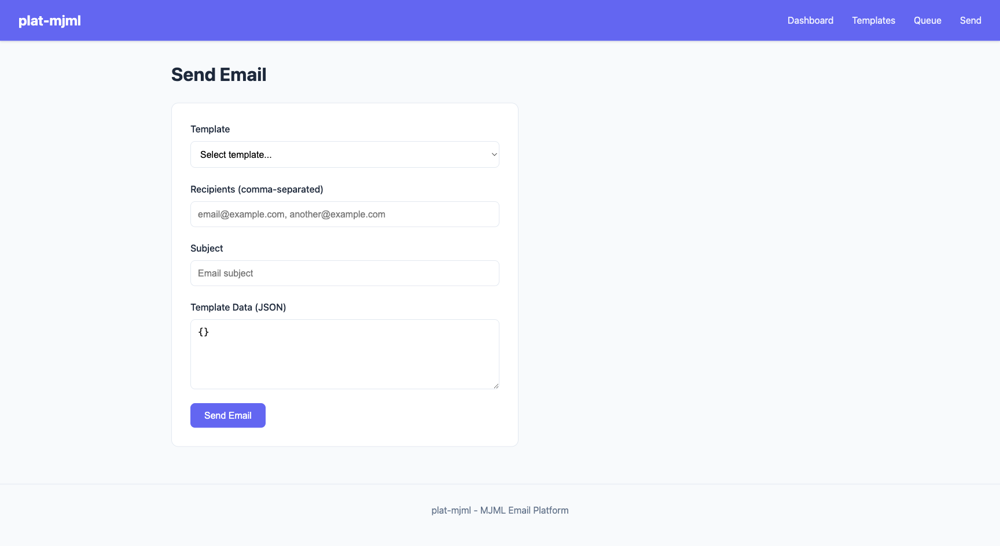

# plat-mjml

MJML email template platform with MCP integration for AI assistants.

## Features

- **MCP Server** — 4 tools for Claude to render templates, send emails, and check delivery status
- **Web UI** — Datastar-based dashboard for email management
- **Email Queue** — SQLite-backed queue with retry and exponential backoff
- **Google Fonts** — CDN-based font integration for email templates
- **CLI Tool** — Render, validate, and send emails from the terminal
- **Go Library** — Embed template rendering in your own Go services

## Quick Start

### Prerequisites

- Go 1.25+
- [Task](https://taskfile.dev) (optional, for convenience commands)

### 1. Start the Server

```bash
# Clone and run
git clone https://github.com/joeblew999/plat-mjml.git
cd plat-mjml
go run ./cmd/server
```

This starts two services:
- **MCP server** on `http://localhost:8080/sse`
- **Web UI** on `http://localhost:8081`

### 2. Connect to Claude

#### Claude Code (CLI)

```bash
claude mcp add plat-mjml -- npx -y mcp-remote http://localhost:8080/sse
```

Then in any Claude Code session:

```
> List the available email templates
> Render the welcome template for a user named Alice
> Send a welcome email to alice@example.com with subject "Welcome aboard"
> Check the status of that email
```

#### Claude Desktop

Add to your `claude_desktop_config.json`:

```json
{
  "mcpServers": {
    "plat-mjml": {
      "command": "npx",
      "args": ["-y", "mcp-remote", "http://localhost:8080/sse"]
    }
  }
}
```

Restart Claude Desktop — the email tools will appear in the tool list.

### 3. Open the Web UI

Visit [http://localhost:8081](http://localhost:8081) to manage templates, monitor the queue, and send test emails.

| Dashboard | Templates |
|:---------:|:---------:|
|  |  |

| Queue | Send |
|:-----:|:----:|
|  |  |

## MCP Tools

The server exposes 4 tools via the [Model Context Protocol](https://modelcontextprotocol.io):

| Tool | Description |
|------|-------------|
| `list_templates` | List all available email templates with descriptions |
| `render_template` | Render an MJML template to HTML with provided data |
| `send_email` | Queue an email for delivery (template + recipients + subject) |
| `get_email_status` | Check delivery status of a queued email by ID |

### Example Conversation with Claude

```
You: Send a password reset email to user@example.com

Claude: I'll send that for you.
[Calls send_email with template="reset_password", to=["user@example.com"],
 subject="Reset Your Password"]

The email has been queued with ID abc123. It will be delivered shortly.

You: What's the status?

Claude: [Calls get_email_status with id="abc123"]

The email is currently in "processing" status. It's been attempted once
and is being delivered now.
```

## Email Delivery Setup

To actually send emails, configure Gmail SMTP credentials:

```bash
cp .env.example .env
```

Edit `.env`:
```
GMAIL_USERNAME=your-email@gmail.com
GMAIL_APP_PASSWORD=your-app-password
```

> **Note:** Generate an [App Password](https://myaccount.google.com/apppasswords) in your Google account settings. Regular passwords won't work with 2FA enabled.

Without credentials, emails are queued but delivery will fail (useful for testing the queue UI).

## CLI Usage

```bash
# List available templates
go run . list

# Render a template to stdout
go run . render -template=welcome

# Render to file
go run . render -template=welcome -out=welcome.html

# Validate rendered HTML for email client compatibility
go run . validate -file=welcome.html

# Send a rendered HTML file
go run . send -to=test@example.com -file=welcome.html
```

Or with Task:

```bash
task list
task render TEMPLATE=welcome OUT=./.data/welcome.html
task validate FILE=./.data/welcome.html
task send TO=test@example.com FILE=.data/welcome.html
```

## Templates

| Template | Description |
|----------|-------------|
| `simple` | Basic email |
| `welcome` | Welcome/activation email |
| `reset_password` | Password reset with security info |
| `notification` | System notifications |
| `premium_newsletter` | Newsletter with premium fonts |
| `business_announcement` | Business announcements |

All templates use Google Fonts (Inter) with email-safe fallbacks (Arial, Helvetica, sans-serif). Font CSS uses CDN URLs so it works in email clients that support `@font-face` (Apple Mail, iOS Mail, Thunderbird).

## Library Usage

```go
import "github.com/joeblew999/plat-mjml/pkg/mjml"

renderer := mjml.NewRenderer(
    mjml.WithCache(true),
    mjml.WithTemplateDir("./templates"),
)

renderer.LoadTemplatesFromDir("./templates")

html, err := renderer.RenderTemplate("welcome", map[string]any{
    "name":  "John Doe",
    "email": "john@example.com",
})
```

## Project Structure

```
├── main.go              # CLI entry point
├── cmd/server/          # MCP + Web UI server
├── internal/
│   ├── server/          # MCP tools, config, startup
│   └── ui/              # Datastar web UI (gomponents)
├── pkg/
│   ├── mjml/            # MJML rendering, templates, font integration
│   ├── font/            # Google Fonts download + CDN URL capture
│   ├── mail/            # SMTP sending + HTML validation
│   ├── db/              # SQLite (auto-migrating)
│   ├── queue/           # Email queue (goqite)
│   ├── delivery/        # Delivery engine with retry/backoff
│   └── config/          # Path configuration
├── templates/           # MJML email templates
├── config.yaml          # Server configuration
└── docs/                # ADRs, screenshots
```

## Configuration

```yaml
# config.yaml
name: plat-mjml
host: 0.0.0.0
port: 8080

ui:
  name: plat-mjml-ui
  host: 0.0.0.0
  port: 8081

mcp:
  name: mjml-server
  messageTimeout: 30s

templates:
  dir: ./templates

database:
  path: ./.data/plat-mjml.db

delivery:
  maxRetries: 3
  retryBackoff: 5m
  maxBackoff: 4h
  rateLimit: 60
```

## Environment Variables

| Variable | Description | Default |
|----------|-------------|---------|
| `DATA_PATH` | Base data directory | `./.data` |
| `MJML_TEMPLATE_PATH` | Template directory | `./templates` |
| `FONT_PATH` | Font cache directory | `./.data/fonts` |
| `GMAIL_USERNAME` | Gmail address for sending | — |
| `GMAIL_APP_PASSWORD` | Gmail app password | — |

## Task Commands

```bash
task server       # Start MCP server + Web UI
task test         # Run all tests
task list         # List templates
task render       # Render template
task validate     # Validate HTML
task send         # Send email
task build        # Build server binary
task build:cli    # Build CLI binary
task clean:data   # Remove .data/ cache
task kill:ports   # Kill processes on 8080/8081
```

## Architecture

See [ADR-001](docs/adr/001-email-platform-architecture.md) for detailed architecture decisions.

## Acknowledgements

- [gomjml](https://github.com/preslavrachev/gomjml) by [Preslav Rachev](https://github.com/preslavrachev) — Pure Go MJML renderer. No Node.js required.
- [go-zero](https://github.com/zeromicro/go-zero) by [Kevin Wan](https://github.com/kevwan) — Cloud-native Go microservices framework. Powers MCP server, Web UI (rest.Server), service lifecycle (ServiceGroup), graceful shutdown, and structured logging (logx).
- [goqite](https://maragu.dev/goqite) by [Markus Wüstenberg](https://github.com/maragudk) — SQLite-backed persistent message queue.
- [gomponents](https://maragu.dev/gomponents) + [gomponents-datastar](https://maragu.dev/gomponents-datastar) — Go HTML components with Datastar integration.
